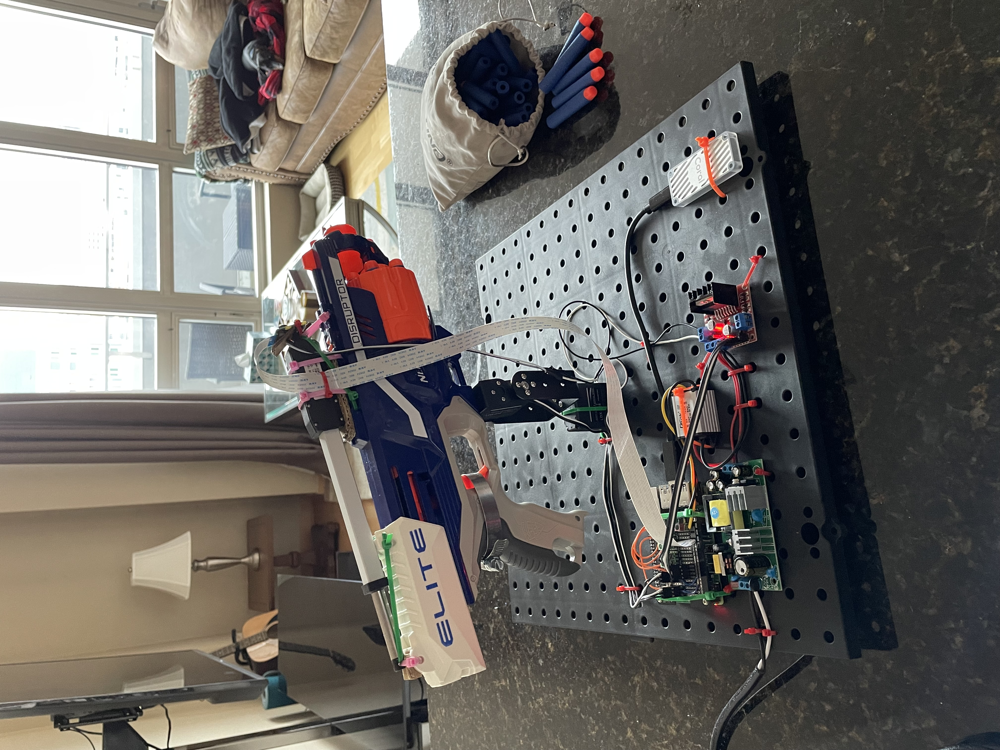

# nerf-blaster
This project remotely controls a nerf blaster using two servos to aim the device, a linear actuator to fire the device, and the pi-camera and tensorflow libraries to perform image tracking.

  
  

## Prerequisites
1. Install node using nvm: https://github.com/nvm-sh/nvm#installing-and-updating
2. Install the angular cli: 
3. Install picamera: `pip3 install picamera==1.13`
4. Install pigpio: `pip3 install pigpio==1.78`
5. Install flask: `pip3 install flask`
6. Install argparse: `pip3 install argparse`
7. Setup tensorflow: https://github.com/tensorflow/examples/tree/master/lite/examples/object_detection/raspberry_pi

## Running the application
1. Build the frontend application with the command `cd frontend; npm run build; cd ..;`
2. Run the backend application with the command `cd backend; python3 server.py;`
